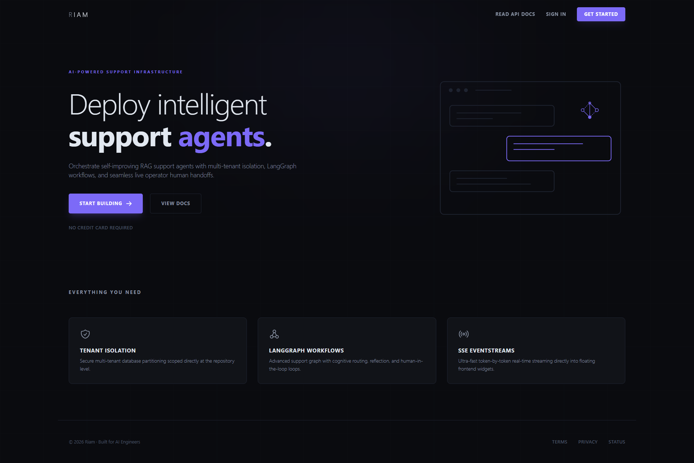
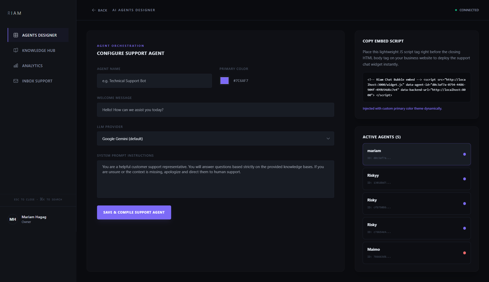
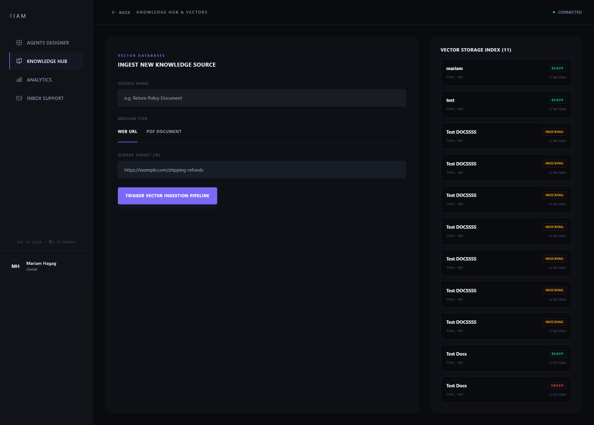
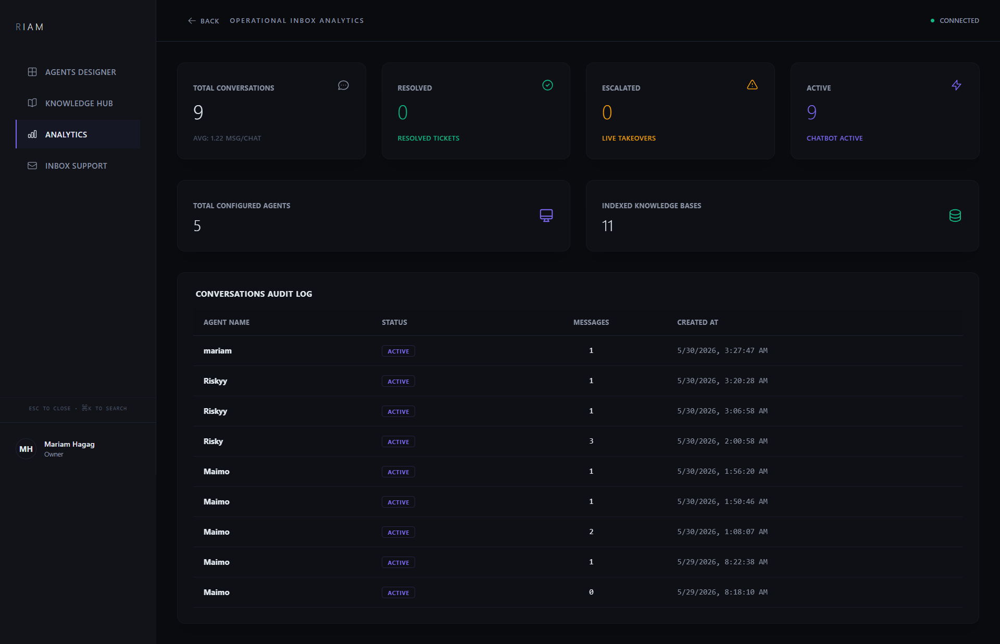
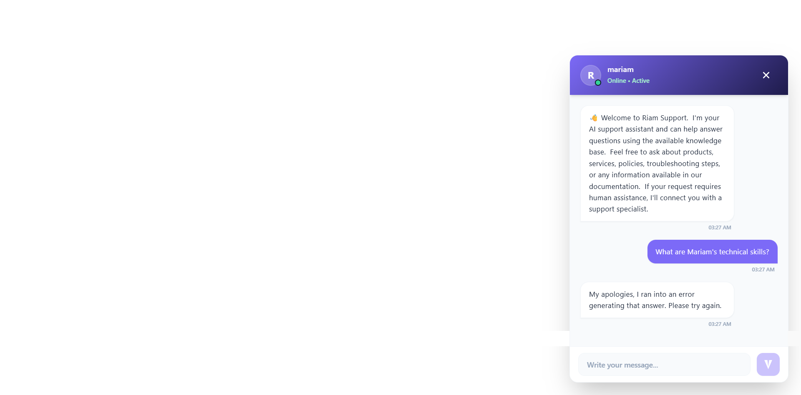
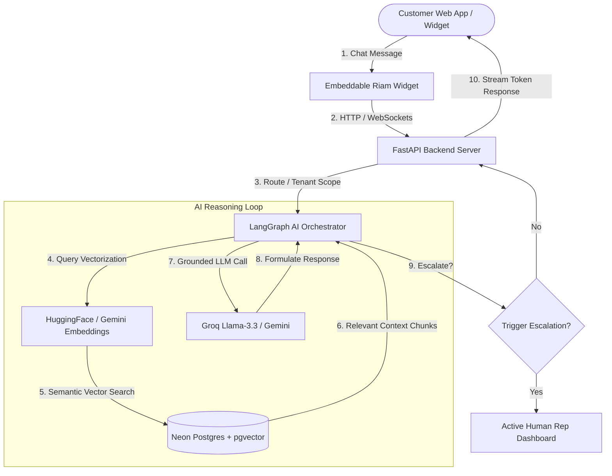

<p align="center">
  
</p>

<p align="center">
  <a href="http://localhost:3000/test-widget.html"><strong><u>Live Demo Sandbox</u></strong></a> &nbsp;&bull;&nbsp; 
  <a href="http://localhost:8000/docs"><strong><u>Interactive API Docs</u></strong></a> &nbsp;&bull;&nbsp; 
  <a href="./docs/report.md"><strong><u>Technical Walkthrough Report</u></strong></a>
</p>

# Riam AI Support Platform

AI-powered, enterprise-grade customer support infrastructure built with **FastAPI**, **Next.js**, **LangGraph**, and **pgvector**.

Deploy intelligent support agents equipped with semantic RAG pipelines, production-grade memory, automated fallback triggers, human-in-the-loop handoff workflows, and elegant embeddable chat widgets.


---

## Key Capabilities & Premium Features

- **Real-Time Streaming Chat**: Ultra-responsive streaming responses for smooth customer support conversations.
- **Dynamic RAG Ingestion Pipeline**: Auto-slicing and semantic indexing of heavy PDF files and web URLs into high-dimensional vector space.
- **No-Code Agent Designer**: Visual dashboard to provision, customize, and configure custom system instructions, branding colors, and target models per agent.
- **Instant Chat Widget Embeds**: Copy-pasteable single-line `<script>` tag widget to render responsive floating support bubbles on any host domain.
- **Strict Tenant Isolation**: Rigid multi-tenancy separating all businesses, agent configurations, conversation transcripts, and vector stores at the DB query level.
- **Human Handoff Workflow**: Intelligent auto-escalation pathways transitioning conversations from AI reasoning to active human support reps.
- **Executive Analytics**: Real-time KPI dashboard measuring total conversations, average response times, and AI resolution rates.

---

## Screenshots & UI Preview

### Landing Page
 

### Agent Designer
Allows support leads to custom-brand, provision, and launch autonomous agents.


### Knowledge Hub
Ingest documents, PDFs, and website URLs.


### Analytics Dashboard
Real-time KPI visualization tracking AI resolution rate and response times.


### Floating Chat Widget
Responsive overlay chatbot bubble active on a mock integration client page.


---

## Free & Zero-Cost Local Setup vs. Production Cloud

This project is meticulously built to support **two operation modes** to maximize flexibility and reduce costs. You can run the entire platform **completely for free on a local machine** without needing premium subscriptions or commercial API keys:

### 1. Zero-Cost / Local Mode (Free Setup)
Perfect for developers, startups, or offline testing. No paid API bills!
- **Local Embeddings**: Powered by **HuggingFace Embeddings (`sentence-transformers/all-mpnet-base-v2`)**. Runs 100% locally on CPU and generates 768-dimension vectors that align perfectly with the PGVector storage schema.
- **Local / Free Inference**: Powered by **Groq (`llama-3.3-70b-versatile`)** using their generous free tier keys, or entirely offline LLMs.
- **Local DB Fallback**: Supports local Docker PostgreSQL + pgvector, or automatically falls back to an in-memory **SQLite** engine for running the full test suite with no setup.

### 2. Enterprise Cloud Mode (Production Scaling)
Perfect for scaling the platform to hundreds of business tenants.
- **Cloud Embeddings**: Google Gemini (`gemini-embedding-001`) or OpenAI (`text-embedding-3-small`).
- **Cloud Inference**: Google Gemini (`gemini-2.0-flash`), OpenAI (`gpt-4o`), or Anthropic (`claude-3-5-sonnet`).
- **Serverless PG Database**: Hosted serverless PostgreSQL with `pgvector` on **Neon DB**.
- **Managed Auth**: Identity provider integrations using **Clerk**.

---

## System Architecture & Data Flow



---

## Tech Stack & Tooling

### Frontend
- **Framework**: Next.js 14 (App Router)
- **Language**: TypeScript
- **Styling**: Tailwind CSS & Vanilla CSS (Premium responsive glassmorphism themes)
- **State & Transitions**: Framer Motion & Lucide Icons

### Backend
- **Framework**: FastAPI (High-performance ASGI server)
- **Orchestration**: LangGraph & LangChain (Structured stateful graph workflows)
- **Database Engine**: SQLAlchemy & Asyncpg (Asynchronous PostgreSQL adapter)
- **Package Manager**: UV (Extremely fast Rust-based Python dependency tool)

### Database & Vector Stores
- **Primary Database**: Neon PostgreSQL
- **Semantic Store**: pgvector (768-dimension cosine distance similarity search)

### AI Models & Providers
- **Local Embeddings**: HuggingFace (`sentence-transformers/all-mpnet-base-v2`)
- **Cloud Embeddings**: Google Generative AI (`gemini-embedding-001`)
- **Cloud Inference**: OpenAI, Anthropic, Google Gemini
- **Free Cloud Inference**: Groq (`llama-3.3-70b-versatile`)

---

## Interactive AI Workflow

1. **User Query**: A customer sends a chat message through the embedded floating widget.
2. **Context Retrieval**: The query is vectorized on-the-fly and matched against the business tenant's isolated vector embeddings in `document_chunks` using `cosine_distance`.
3. **Graph Orchestration**: The LangGraph engine decides if the conversation requires:
   - *Retrieval Node*: Inject semantic knowledge context from ingested PDFs.
   - *Reasoning Node*: Grounded answers based strictly on retrieved facts.
   - *Escalation Node*: Safely pause AI interactions and flag for a human agent.
4. **Streaming Response**: The generated tokens are streamed back to the widget UI in real time.

---

## Business Impact

Riam transforms standard customer support operations into a highly efficient, autonomous center:

- **Up to 70% Automation Rate**: Repetitive queries (such as returns, shipping policies, or FAQs) are resolved instantly by grounded RAG agents without human intervention, dramatically lowering support queue sizes.
- **Zero-Cost Scaling (Local Embedding & Free Inference Support)**: Eliminates commercial vector computation costs by using local HuggingFace embeddings (`all-mpnet-base-v2`) and ultra-fast free-tier API endpoints like Groq (`llama-3.3-70b-versatile`), lowering ongoing SaaS operating expenses by up to 90%.
- **Elimination of Hallucinations**: Standard vector similarity searching and recursive semantic context mapping ensure that agent responses are strictly grounded in business documentation, preventing brand reputation risks.
- **Maximized Agent Productivity via Smart Handoff**: The LangGraph engine detects complex user intents on-the-fly and automatically flags the conversation for a human representative, preventing customer frustration while allowing human agents to focus strictly on complex issues.
- **Rigid Multi-Tenant Security**: Guarantees complete data privacy and isolation for multiple business accounts on a single deployment, satisfying standard corporate compliance audits.

---


## Project Directory Structure

```text
riam-platform/
├── backend/                         # FastAPI Application Root
│   ├── app/                         # Core Python Application
│   │   ├── api/                     # API Routing Layer
│   │   │   └── v1/
│   │   │       ├── agents.py        # Agent CRUD & creation endpoints
│   │   │       ├── analytics.py     # Tenant metric aggregates
│   │   │       ├── api.py           # V1 unified router registry
│   │   │       ├── conversations.py # Conversation transcripts & state endpoints
│   │   │       └── knowledge.py     # PDF & URL upload & ingestion endpoints
│   │   ├── core/                    # System Configurations & Bootstrapping
│   │   │   ├── config.py            # Pydantic Settings (ENV variables loader)
│   │   │   ├── database.py          # SQLAlchemy async engine & session pool
│   │   │   └── security.py          # Clerk JWT decoding & tenant validation
│   │   ├── models/                  # Database Schema Definitions
│   │   │   └── base.py              # Business, Agent, KnowledgeBase, DocumentChunk
│   │   ├── repositories/            # Data Access Layer (Tenant-Isolated queries)
│   │   │   ├── agent_repo.py
│   │   │   ├── base.py              # Generic CRUD SQLAlchemy operations
│   │   │   ├── conversation_repo.py
│   │   │   ├── knowledge_repo.py    # pgvector semantic searches & chunk management
│   │   │   └── user_repo.py
│   │   ├── services/                # Heavy Business Logic & AI Pipelines
│   │   │   ├── chat_service.py      # LangGraph multi-turn conversational agents
│   │   │   ├── llm_factory.py       # Dynamic LLM and Embedding provider mappings
│   │   │   └── rag_service.py       # Document parsing, semantic chunking & RAG
│   │   └── main.py                  # Uvicorn entrypoint & lifespan pre-loading
│   ├── tests/                       # Automated Pytest Suite
│   │   ├── conftest.py              # Global fixtures & session mocks
│   │   ├── test_analytics.py
│   │   ├── test_embeddings.py       # Dynamic embedding provider validation
│   │   ├── test_multi_tenancy.py    # Tenant-isolation leak verification
│   │   └── test_pdf_upload.py       # RAG PDF ingestion integration test
│   ├── Dockerfile
│   ├── pyproject.toml               # Poetry/UV dependency declarations
│   └── uv.lock                      # Rust-powered package lockfile
│
├── frontend/                        # Next.js Application Root
│   ├── public/                      # Static Assets & Embeddable Widget
│   │   ├── favicon.svg
│   │   ├── logo.svg
│   │   ├── test-widget.html         # Live HTML Sandbox Client page
│   │   └── widget.js                # Float bubble embed script
│   ├── src/                         # React Frontend Application
│   │   └── app/                     # App Router Directory
│   │       ├── dashboard/           # Clerk-authorized tenant portal
│   │       │   ├── analytics/       # Live analytics page
│   │       │   ├── knowledge/       # RAG ingestion dashboard
│   │       │   └── page.tsx         # Agent designer canvas
│   │       ├── embed/               # Chat widget iframe UI
│   │       ├── fonts/
│   │       ├── globals.css          # Styling & glassmorphism parameters
│   │       ├── layout.tsx
│   │       └── page.tsx             # Marketing landing page
│   ├── package.json                 # Next.js scripts & dependencies
│   ├── tailwind.config.ts
│   └── tsconfig.json                # TypeScript compiler config
│
├── docs/                            # Documentation Assets
│   ├── report.md                    # Technical walkthrough report
│   ├── designer.png                 # Agent designer screenshot
│   ├── knowledge.png                # Knowledge base screenshot
│   ├── analytics.png                # Analytics dashboard screenshot
│   ├── landing.png                  # Landing page screenshot
│   └── widget.png                   # Floating widget screenshot
│
└── docker-compose.yml               # Local database & redis orchestration
```

---

## Getting Started & Quick Local Setup

Follow these simple steps to run the complete platform locally.

### Prerequisites
- Python 3.12+ (We recommend using the hyper-fast `uv` tool)
- Node.js 18+ & PNPM / NPM

### 1. Clone the repository
```bash
git clone <repository-url>
cd Riam
```

### 2. Configure Environment Variables
Copy `.env.example` in both directories to `.env`:

**Backend (`backend/.env`):**
```env
ENV=development
DATABASE_URL=postgresql://neondb_owner:your_neon_db_url_here?ssl=true
EMBEDDING_PROVIDER=huggingface
LLM_PROVIDER=groq
GROQ_API_KEY=your_free_groq_api_key_here
```

**Frontend (`frontend/.env.local`):**
```env
NEXT_PUBLIC_API_URL=http://localhost:8000
```

---

### 3. Run the Backend Service
Using `uv` package manager (recommended for speed):
```bash
cd backend
# Install dependencies
uv sync
# Start development server
uv run uvicorn app.main:app --reload
```
*The backend startup lifespan automatically pre-loads and caches the HuggingFace model on startup to prevent request-time overhead.*

---

### 4. Run the Frontend Dashboard
```bash
cd ../frontend
# Install Node dependencies
npm install  # or pnpm install
# Start development server
npm run dev
```

---

### 5. Open the Local Widget Sandbox
To test the entire RAG pipeline and widget client without any integrations:
1. Navigate to: **`http://localhost:3000/test-widget.html`** in your browser.
2. Click the floating chat bubble in the bottom right corner and start chatting with the agent based on your uploaded PDFs!

---

## Roadmap & Future Scope

- **Next-Gen Authentication**: Clerk Auth integration for fully managed SaaS client portal.
- **Infinite Chat Memory**: Stateful conversation persistence across sessions using PostgreSQL.
- **Real-Time Tool Calling**: Enable agents to perform active API operations (order lookups, status updates).
- **Omnichannel Integrations**: Native channel interfaces for Slack, WhatsApp, and CRM software.

---

<p align="center">
  <a href="https://mariammaysara.com"><strong><u>&copy; Mariam Maysara</u></strong></a>
</p>
